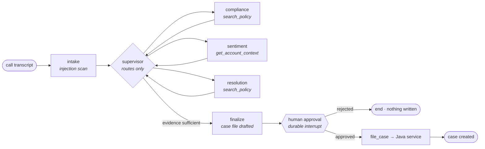

# agentic-call-triage

A multi-agent LangGraph system that triages contact-center call transcripts: it routes a
call through compliance, sentiment, and resolution specialists, grounds every finding in
a retrieved policy, drafts a case file, and then **stops and waits for a human** before
writing anything into the system of record.

The domain is deliberate. Automated review of collections calls is a place where a wrong
answer is a regulatory problem, not a bad user experience — so it forces the design to
take governance, grounding, and human accountability seriously rather than bolting them
on.



## Running it

```bash
make setup                 # venv + install
make fast                  # full trajectory in ~1s on the stub backend
make test                  # 24 behavioural tests, no model needed

ollama pull qwen2.5:7b
make demo                  # the real thing, local model
make java                  # in another shell: the system of record on :8080
```

The durability demo is the one worth watching — two separate processes:

```bash
make pause                                    # runs, suspends at the human gate, exits
triage resume --thread demo --approve         # a different process picks it up
```

Nothing is held in memory between those commands. The run state lives in SQLite, so the
second process resumes mid-node from the checkpoint. That is what makes the human gate a
real workflow step rather than a blocking `input()` call.

## Design decisions worth arguing about

**The supervisor routes; it does not analyse.** Keeping domain reasoning out of the
router is what lets a specialist be swapped, retuned, or replaced without touching
routing behaviour. It also keeps the router's prompt short, which keeps its latency and
its failure surface small.

**Termination is enforced in code, not requested in a prompt.** The supervisor gets a
vote on what runs next, not a veto on stopping. A completed-set check and a hard step cap
sit above it in `graph.py`. Every agent system that has ever burned a five-figure token
bill overnight did so because someone trusted a prompt to say "stop".

**Severity is computed, not generated.** The model writes the summary; the code takes the
max severity across findings. Anything a downstream system routes or alerts on should be
derived deterministically from evidence — a model asked to self-assess severity will
drift, and the drift is invisible.

**The write action is not a tool.** `file_case` is a plain function the graph calls after
approval. It is absent from every tool list, so the model cannot reach it by choosing it.
This is the structural answer to excessive agency: don't ask a model to be disciplined
about destructive actions, remove the capability.

**Transcripts are untrusted input.** A transcript is third-party text entering the
context window — the same threat class as a retrieved document or a scraped page.
`CALL-10043` carries a real injection payload instructing the system to mark the call
clean. It gets fenced, scanned, flagged on the case file, and reported as a finding.
The scanner is a tripwire; the actual containment is that the write path is gated on a
human regardless of what the model concluded.

**Schema violations are repaired, then counted.** Small models drift off a JSON schema
often enough that a repair loop is mandatory, so `structured()` feeds the validation
error back and retries. The repair count is recorded per node, which turns schema drift
into a metric you can alert on instead of an outage you discover later.

**Degradation is labelled, not hidden.** If the backend can't do tool calling, the
specialist reasons from the transcript alone and stamps `DEGRADED` on the trace rather
than failing the run or silently producing weaker output.

## The serving tier

Nothing above `llm.py` knows which backend is running. Three are supported: `ollama`
for laptop development, `vllm` for a real deployment, and `stub` for tests.

```bash
vllm serve Qwen/Qwen2.5-7B-Instruct \
  --port 8000 \
  --enable-prefix-caching \          # the big one for agents, see below
  --enable-chunked-prefill \
  --max-model-len 8192 \
  --gpu-memory-utilization 0.90 \
  --tensor-parallel-size 2 \
  --enable-auto-tool-choice --tool-call-parser hermes

TRIAGE_PROVIDER=vllm VLLM_BASE_URL=http://vllm:8000/v1 triage run --call CALL-10041
```

Prefix caching matters disproportionately for a system shaped like this one. Every
specialist call repeats the same fenced transcript and the same tool schemas; a triage
run is seven LLM calls sharing a long common prefix. With prefix caching on, the KV
blocks for that prefix are computed once and reused across the run, so most of the calls
skip the bulk of their prefill. The workload is also bursty — call recordings arrive in
batches — which is exactly the shape continuous batching is built for.

## What this is not

It is a weekend build, not a production system. Retrieval is lexical scoring over seven
policies rather than a vector store — correct at this size, wrong at ten thousand. There
is no auth, no rate limiting, and no multi-tenancy. Traces print to a terminal instead
of going to OpenTelemetry. The Java service holds cases in a `ConcurrentHashMap`.

Each of those is a deliberate stopping point rather than an oversight, and each one has
a known replacement.
